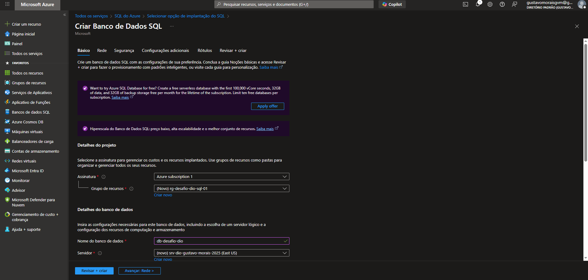
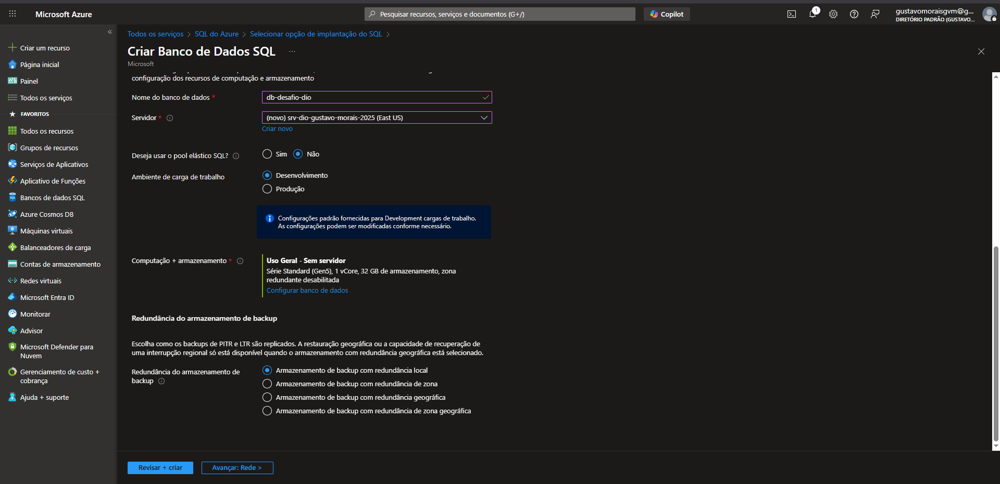
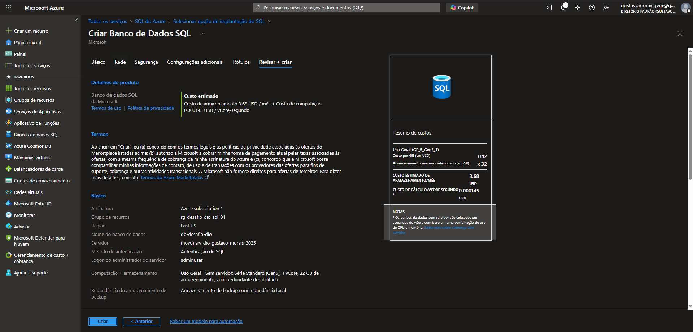
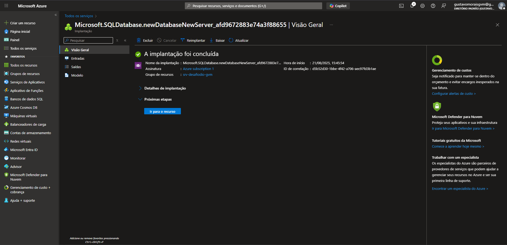
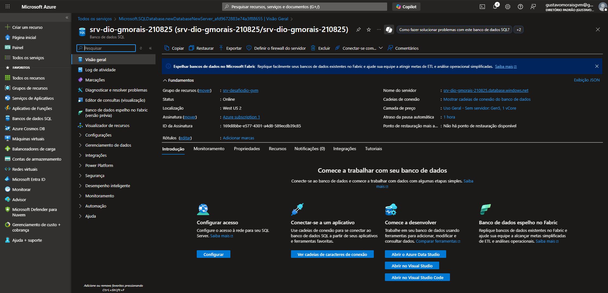
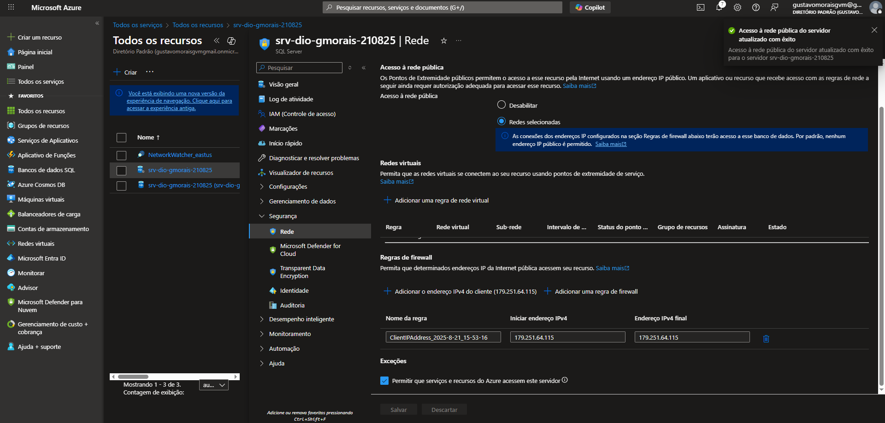
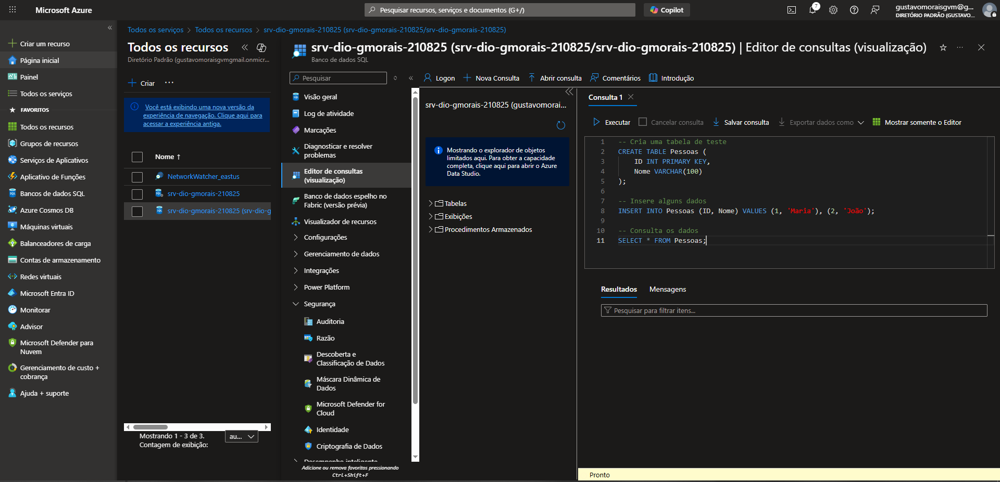

# Desafio de Projeto DIO: Criando um Banco de Dados SQL no Azure

Repositório criado para o Desafio de Projeto da [Digital Innovation One (DIO)](https://www.dio.me/).
**Bootcamp:** Formação Azure AI Fundamentals

## 🎯 Objetivo
Este projeto prático teve como objetivo provisionar uma instância de Banco de Dados SQL no Microsoft Azure, configurar suas regras de acesso e realizar uma conexão para validar o funcionamento. O processo foi documentado para servir como um guia de referência e material de estudo sobre serviços de banco de dados PaaS na nuvem.

---

## 📝 Anotações e Dicas sobre o Azure SQL

* **PaaS vs. IaaS:** Diferente de uma VM (IaaS), onde gerenciamos o Sistema Operacional, o Azure SQL é um serviço de **PaaS (Plataforma como Serviço)**. A Microsoft gerencia toda a infraestrutura subjacente, incluindo atualizações e patches de segurança, nos permitindo focar apenas nos dados e na aplicação.
* **Servidor Lógico:** O Banco de Dados SQL do Azure precisa de um "Servidor SQL Lógico" para ser criado. Ele atua como um ponto de administração central para múltiplos bancos de dados, gerenciando logins, regras de firewall e configurações. O nome deste servidor precisa ser globalmente único.
* **Firewall é Crucial:** Por padrão, o acesso ao servidor é bloqueado. A etapa de configurar o **Firewall** para permitir o IP do cliente e o acesso de outros serviços do Azure é fundamental para que a conexão funcione.
* **Modelo de Compra:** A escolha entre DTU e vCore impacta o custo e o desempenho. Para estudos e ambientes de desenvolvimento, a camada **Serverless (Sem Servidor)** do modelo vCore é excelente, pois pode pausar automaticamente e reduzir custos quando não está em uso.

---

## 🛠️ Laboratório Prático: Passo a Passo

### 1. Criação do Banco de Dados e Servidor Lógico
O processo iniciou-se no portal do Azure, com a criação de um Grupo de Recursos e a definição dos detalhes do banco de dados.

Em seguida, foi configurado o Servidor Lógico, que hospeda o banco de dados. O nome do servidor (`srv-dio-gustavo-morais-2025`) foi definido como globalmente único e a camada de computação foi ajustada para "Uso Geral - Sem servidor", otimizando os custos.

### 2. Validação e Implantação
Após a configuração, o Azure apresentou um resumo com a estimativa de custos e realizou uma validação para garantir que todos os parâmetros estavam corretos. Com a validação aprovada, a implantação foi iniciada.

O processo de implantação foi concluído com sucesso, indicando que todos os recursos foram provisionados corretamente na nuvem da Microsoft.

### 3. Configuração do Acesso via Firewall
Com a instância criada, o próximo passo foi acessar a página de "Visão Geral" do novo banco de dados.

Para permitir a conexão, foi necessário navegar até as configurações do Servidor Lógico e, na seção "Redes", adicionar uma regra de firewall para liberar o acesso do meu endereço IP de cliente.

### 4. Conexão e Validação via Query Editor
Utilizando o **Editor de Consultas (versão prévia)**, uma ferramenta nativa do portal do Azure, foi possível conectar ao banco de dados usando as credenciais de administrador.

Para validar o funcionamento, uma tabela de teste (`Pessoas`) foi criada, populada com dados e, por fim, consultada com sucesso, retornando os resultados esperados. Esta etapa confirma que todo o processo, da criação à conexão, foi bem-sucedido.

---

## ✅ Conclusão
Este desafio permitiu uma imersão prática nos serviços de banco de dados gerenciados do Azure. A experiência de configurar um Azure SQL Database reforça a agilidade e o poder dos serviços PaaS, que abstraem a complexidade da infraestrutura e permitem que equipes foquem no desenvolvimento e na gestão de dados.

## 🔗 Links Úteis
* [Portal do Azure](https://portal.azure.com)
* [Documentação: Início Rápido - Criar um Banco de Dados SQL do Azure](https://learn.microsoft.com/pt-br/azure/azure-sql/database/single-database-create-quickstart)
